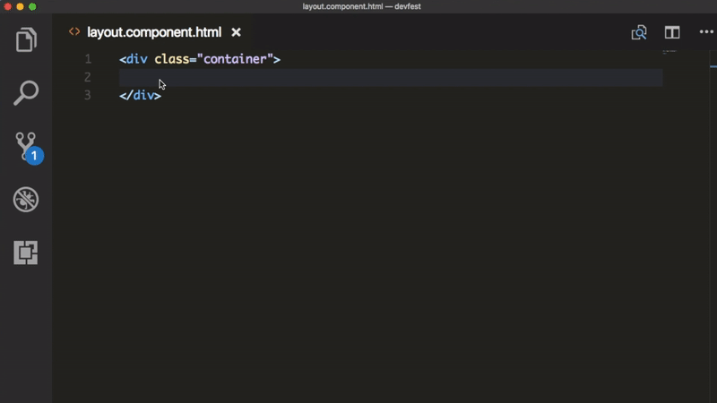

# Angular Material v7 Snippets for VS Code

This extension for Visual Studio Code adds snippets of HTML and TypeScript for Angular Material.

Have a look at [CHANGELOG](CHANGELOG.md) for the latest changes

## Installation

1.  Install Visual Studio Code 1.10.0 or higher
1.  Launch VS Code
1.  Hit `Cmd`-`Shift`-`P` (macOS) or `Ctrl`-`Shift`-`P` (Windows, Linux)
1.  Select `Install Extension`
1.  Choose the extension `Angular Material v7 snippets`
1.  Reload Visual Studio Code

## Usage

Start typing `a-md-*` and hit `enter`, the snippet spreads out.

### HTML Snippets

| Snippet               | Purpose                                                            |
| --------------------- | ------------------------------------------------------------------ |
| a-md-auto-complete    | `<mat-autocomplete>` control with `*ngFor`                         |
| a-md-badge            | `matBadge` with all configutration                                 |
| a-md-badge-button     | `matBadge` on button `mat-button`                                  |
| a-md-button           | `mat-button` basic button                                          |
| a-md-button-link      | `mat-button` basic button with `routerLink`                        |
| a-md-raised-button    | `mat-raised-button` button                                         |
| a-md-button-toggles   | `<mat-button-toggle-group>` control                                |
| a-md-icon-button      | `mat-icon-button` button                                           |
| a-md-card             | `<mat-card>` control basic card                                    |
| a-md-card-simple      | `<mat-card>` control simple card                                   |
| a-md-checkbox         | `<mat-checkbox>` control with `ngModel`                            |
| a-md-checkbox-fc      | `<mat-checkbox>` control with `formControlName`                    |
| a-md-chips            | `<mat-chip-list>` control with `<mat-chip>`                        |
| a-md-chip             | `<mat-chip>` control for `<mat-chip-list>`                         |
| a-md-data-table       | `<mat-table>` control                                              |
| a-md-datepicker       | `<mat-datepicker>` control                                         |
| a-md-divider          | `<mat-divider>` control                                            |
| a-md-inset-divider    | `<mat-divider>` control configured `inset`                         |
| a-md-ex-panel         | `<mat-expansion-panel>` control for expandable summary view        |
| a-md-fab              | `mat-fab` Floating action button                                   |
| a-md-fab-mini         | `mat-mini-fab` Floating action mini button                         |
| a-md-grid             | `<mat-grid-list>` control for grid-based layout                    |
| a-md-grid-tile        | `<mat-grid-tile>` Grid tile for `<mat-grid-list>` control          |
| a-md-input            | `matInput` directive                                               |
| a-md-input-fc         | `matInput` with `formControlName` enclosed `<mat-form-field>`      |
| a-md-input-ngModel    | `matInput` with `ngModel` enclosed `<mat-form-field>`              |
| a-md-input-error      | `mat-error` control for `matInput`                                 |
| a-md-input-icon       | `matInput` wtih icon suffixed                                      |
| a-md-list             | `<mat-list>` control with default `<mat-list-item>`                |
| a-md-list-item        | `<mat-list-item>` single item                                      |
| a-md-selection-list   | `<mat-selection-list>` control with default `<mat-list-option>`    |
| a-md-list-option      | `<mat-list-option>` single item                                    |
| a-md-icon-list        | `<mat-list>` with default `<mat-icon matListIcon>`                 |
| a-md-menu             | `<mat-menu>` control with default items                            |
| a-md-menu-nested      | Nested `<md-menu>` with default items                              |
| a-md-menu-with-icon   | `<mat-menu>` control with default items and icon                   |
| a-md-paginator        | `<mat-paginator>` control for pagination                           |
| a-md-progress-bar     | `<mat-progress-bar>` control with `indeterminate` mode             |
| a-md-progress-spinner | `<mat-progress-spinner>` control with `indeterminate` mode         |
| a-md-radio            | `<mat-radio-group>` control with default `<mat-radio-button>`      |
| a-md-radio-btn        | `<mat-radio-button>` button                                        |
| a-md-ripple           | `matRipple` and `matRippleColor` directives                        |
| a-md-ripple-container | Ripple container                                                   |
| a-md-select           | `<mat-select>` control                                             |
| a-md-select-fc        | `<mat-select>` control with `formControlName`                      |
| a-md-select-ngModel   | `<mat-select>` control with `ngModel`                              |
| a-md-select-option    | `<mat-option>` for `<mat-select>`                                  |
| a-md-slider           | `<mat-slider>` control default horizontal                          |
| a-md-slider-vertical  | `<mat-slider>` control vertical                                    |
| a-md-sidenav          | `<mat-sidenav>` control with `*ngFor` to iterate through nav items |
| a-md-stepper          | `<mat-horizontal-stepper>` control with `<mat-step>`               |
| a-md-step             | `<mat-step>` control with `<form>`                                 |
| a-md-switch           | `<mat-slide-toggle>` switch control                                |
| a-md-tab              | `<mat-tab>` control with set of two tabs                           |
| a-md-toolbar          | `<mat-toolbar>` control with primary color as default              |
| a-md-tooltip          | `matTooltip` directive to display tooltip                          |
| a-md-tooltip-position | `matTooltipPosition` directive to set position                     |
| a-md-tree             | `<mat-tree>` control                                               |
| a-md-tree-node        | `<mat-tree-node>` control                                          |
| a-md-tree-nested-node | `<mat-nested-tree-node>` control                                   |

### TypeScript Snippets

| Snippet       | Purpose                     |
| ------------- | --------------------------- |
| a-md-snackbar | `MatSnackBar` configuration |

### Using NgRx in Angular Apps

- Check out [NgRx Snippets](https://bit.ly/ngrx-vscode)

#### Inspiration from [Angular Typescript Snippets](https://marketplace.visualstudio.com/items?itemName=johnpapa.Angular2) by [John Papa](https://github.com/johnpapa/)
